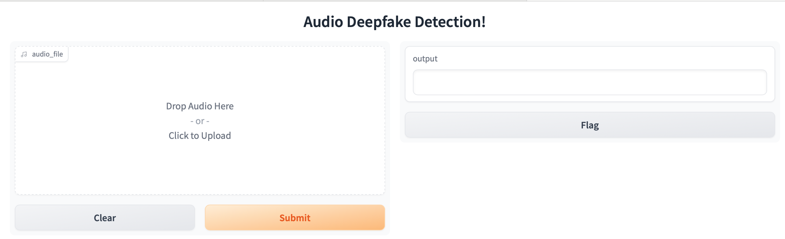
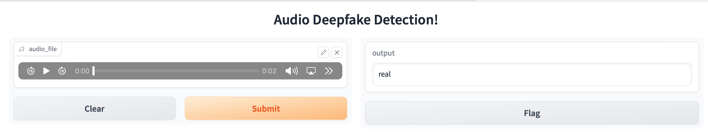

# Audio Deepfake Detection - add


### Code:

Below are the step to setup the code and perform training

### Setup:

After setting up the code as below, update the paths appropriately

> git clone https://github.com/ksasi/add.git
> 
> git clone https://github.com/TakHemlata/SSL_Anti-spoofing.git

### Install Dependencies:

> cd add
> 
> pip install -r requirements.txt
> 
> cd SSL_Anti-spoofing
> 
> pip install -r requirements.txt

- Copy all the files in `code` folder of `add` repository into `SSL_Anti-spoofing` folder


## Audio Deepfake Detection

### Datasets :

- Create and change directory to ***datasets*** under ***add***
- Download [Custom Dataset] (https://iitjacin-my.sharepoint.com/:u:/g/personal/ranjan_4_iitj_ac_in/EY95OumOlZ5NpIK6qWTKwmwBKiRmhKzDkQ5jpjt1NKGTPw?e=rtbmh8)
- Download [FOR dataset] (https://www.eecs.yorku.ca/~bil/Datasets/for-2sec.tar.gz)

The datasets have the following structure after extraction :

```
Custom Dataset/FOR dataset
data
├── Real
│   │ 
│   │ Central Avenue 3.wav
│   │ RealGlindaOriginalVoice.mp3
│   │ ...
├── Fake
│   │
│   │ Anthony+US.wav
│   │ 3ae86dc151041de1e2bdbf8de03f42b3.mp3
│   │ ...

```

### Models :

- Create and change directory to ***models*** under ***add***

- Download Pre-trained SSL antispoofing models for LA and DF from [here](https://drive.google.com/drive/folders/1c4ywztEVlYVijfwbGLl9OEa1SNtFKppB?usp=sharing)

### Models Evaluation of SSL W2V model trained for LA and DF tracks of the ASVSpoof dataset (With Custom Dataset):

Execute the below scripts to evaluate SSL W2V model trained for LA and DF tracks of the ASVSpoof dataset with Custom Dataset

- LA Track

> cd SSL_Anti-spoofing
> 
> nohup python \<root\_path\>/SSL\_Anti-spoofing/evaluate\_model\_dataset.py --track='LA' --dataset\_path='\<root\_path\>/add/datasets/Dataset\_Speech\_Assignment' --model_path='\<root\_path\>/add/models/LA\_model.pth' --batch\_size=128 >> \<root\_path\>/add/logs/custom\_dataset\_LA\_eval.log &
> 
> 


- DF Track

> cd SSL_Anti-spoofing
> 
> nohup python \<root\_path\>/SSL\_Anti-spoofing/evaluate\_model\_dataset.py --track='DF' --dataset\_path='\<root\_path\>/add/datasets/Dataset\_Speech\_Assignment' --model_path='\<root\_path\>/add/models/Best\_LA\_model\_for\_DF.pth' --batch\_size=128 >> \<root\_path\>/add/logs/custom\_dataset\_DF\_eval.log &
> 
> 

### Models Finetuning (With FOR datataset) :

Execute the below scripts to finetune both LA and DF track models on FOR dataset

- LA Track

> cd SSL_Anti-spoofing
> 
> 
> 
> nohup python \<root\_path\>/SSL\_Anti-spoofing/finetune\_model\_dataset.py --track='LA'  --dataset\_path='\<root\_path\>/add/datasets/for-2seconds' --model\_path='\<root\_path\>/add/models/LA\_model.pth' --batch_size=128 --dataset\_name='FOR' --epochs=30 --learning\_rate=0.0001 --weight\_decay=1e-4 --save\_path='\<root\_path\>/add/models' --comment='finetune' >> \<root\_path\>/add/logs/for\_dataset\_LA\_finetune.log &
> 
> 


- DF Track

> cd SSL_Anti-spoofing
> 
> 
> nohup python \<root\_path\>/SSL\_Anti-spoofing/finetune\_model\_dataset.py --track='DF'  --dataset\_path='\<root\_path\>/add/datasets/for-2seconds' --model\_path='\<root\_path\>/add/models/Best\_LA\_model\_for\_DF.pth' --batch\_size=128 --dataset\_name='FOR' --epochs=30 --learning\_rate=0.0001 --weight\_decay=1e-4 --save\_path='\<root\_path\>/add/models' --comment='finetune' >> \<root\_path\>/add/logs/for\_dataset\_DF\_finetune.log &
> 
> 


### Models Evaluation of finetuned models for LA and DF tracks (With FOR test dataset):

Execute the below scripts to evaluate finetuned models of both LA and DF tracks on FOR test dataset, after selecting the best checkpoints

- LA Track

> cd SSL_Anti-spoofing
> 
> nohup python \<root\_path\>/SSL\_Anti-spoofing/evaluate\_model\_dataset.py --track='LA' --dataset\_path='\<root\_path\>/add/datasets/for-2seconds/testing' --model\_path='\<root\_path\>/add/models/model\_LA\_weighted\_CCE\_30\_128\_0.0001\_finetune/epoch\_28.pth' --batch\_size=128 --dataset\_name='FORTest datatset on fine-tuned model' >> \<root\_path\>/add/logs/FORTest\_dataset\_LA\_ft\_eval.log &
> 

- DF Track

> cd SSL_Anti-spoofing
> 
> nohup python \<root\_path\>/SSL\_Anti-spoofing/evaluate\_model\_dataset.py --track='DF' --dataset\_path='\<root\_path\>/add/datasets/for-2seconds/testing' --model\_path='\<root\_path\>/add/models/model\_DF\_weighted\_CCE\_30\_128\_0.0001\_finetune/epoch\_29.pth' --batch\_size=128 --dataset\_name='FORTest datatset on fine-tuned model' >> \<root\_path\>/add/logs/FORTest\_dataset\_DF\_ft\_eval.log &
> 
> 


### Models Evaluation of finetuned models for LA and DF tracks (With custome dataset):

Execute the below scripts to evaluate finetuned models of both LA and DF tracks on custom dataset, after selecting the best checkpoints

- LA Track

> cd SSL_Anti-spoofing
> 
> nohup python \<root\_path\>/SSL\_Anti-spoofing/evaluate\_model\_dataset.py --track='LA' --dataset\_path='\<root\_path\>/add/datasets/Dataset\_Speech\_Assignment' --model\_path='\<root\_path\>/add/models/model\_LA\_weighted\_CCE\_30\_128\_0.0001\_finetune/epoch\_28.pth' --batch\_size=128  --dataset\_name='custom datatset on fine-tuned model' >> \<root\_path\>/add/logs/custom\_dataset\_LA\_ft\_eval.log &
> 

- DF Track

> cd SSL_Anti-spoofing
> 
> nohup python \<root\_path\>/SSL\_Anti-spoofing/evaluate\_model\_dataset.py --track='DF' --dataset\_path='\<root\_path\>/add/datasets/Dataset\_Speech\_Assignment' --model\_path='\<root\_path\>/add/models/model\_DF\_weighted\_CCE\_30\_128\_0.0001\_finetune/epoch\_29.pth' --batch\_size=128 --dataset\_name='custom datatset on fine-tuned model' >> \<root\_path\>/add/logs/custom\_dataset\_DF\_ft\_eval.log &
> 


### Demo (Audio Deepfake Detection) :

Demo of **Audio Deepfake Detection** from audio input can be executed by running `Audio_Deepfake_Detection_Demo.ipynb` ipython notebook in the Demo folder

- Step1



- Step2



### References

- EER Metric - [blog](https://yangcha.github.io/EER-ROC/)
- Torchmetrics - [Link](https://lightning.ai/docs/torchmetrics/stable/audio/scale_invariant_signal_noise_ratio.html)
- SSL_Anti-spoofing - [Link](https://github.com/TakHemlata/SSL_Anti-spoofing)